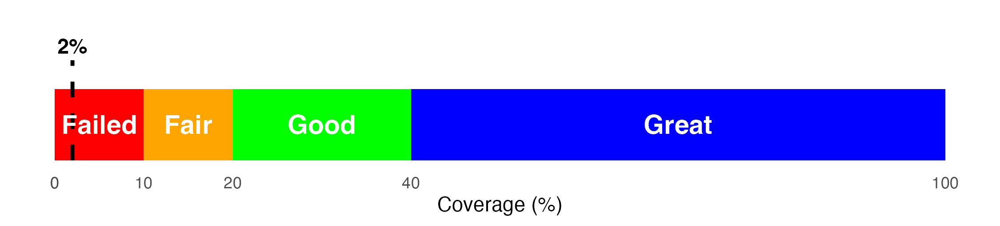

```{r setup, include=FALSE}
source('reportimages/report_includes.R')
library(rvest)
library(magrittr)
library(kableExtra)
library(knitr)
library(dplyr)
library(htmltools)
library(ggplot2)

# Read and parse the HTML file
html_folder <- params$folder
html_content <- read_html(file.path(html_folder,"db.proteins.html"))
html_summary <- read_html(file.path(html_folder,"db.summary.html"))
```

```{r extract, include=FALSE}
# Extract image URLs
image_urls <- html_summary %>% html_nodes("img") %>% html_attr("src")
Fig1_url <- paste0(html_folder,"/",image_urls[grepl("FDRFigure", image_urls)]  %>% gsub("\\\\", "/",.))
Fig2_url <- paste0(html_folder,"/",image_urls[grepl("ScoreHistogram", image_urls)]  %>% gsub("\\\\", "/",.))
Fig3_url <- paste0(html_folder,"/",image_urls[grepl("ScorePlotFigure", image_urls)]  %>% gsub("\\\\", "/",.))


# Extract tables by CSS selectors (e.g., class or id)
tables <- html_summary %>%
  html_nodes(css = ".stats") %>%
  html_table()

Table1 <- tables[[1]]
Table2 <- tables[[2]]
Table3 <- tables[[4]]

# extract coverage % and accession nb for bait protein
proteintable <- html_content %>% html_node(".mytable")
bait <- params$bait
rows <- proteintable %>% html_nodes("tr")
row_index <- grep(paste0("GN=\\b", bait, "\\b"), sapply(rows, function(row) row %>% html_text()), ignore.case = TRUE)
row <- rows[row_index]
# Check if the bait protein is found
if (length(row) > 0) {
  coverage <- row %>% html_node("td:nth-child(5)") %>% html_text() %>% as.numeric()
  accession <- row %>% html_node("td:nth-child(3) a") %>% html_text()
  # extract coverage image for bait protein
  # Find the <a> element with a specific "href" attribute pattern and containing the desired text
  a_element <- html_content %>%
    html_nodes(xpath = sprintf("//a[contains(@href, '#') and contains(text(), '%s')]", toupper(bait)))
  
  # Extract the "href" attribute value from the first matching <a> element
  href_attr <- a_element[[1]] %>%
    html_attr("href")
  numeric_part <- gsub("^#", "", href_attr)
  cov_img_url <- paste0(html_folder,"/img/db", numeric_part, ".png")
} else {
  coverage <- 0
  cov_img_url <- NULL
}  

if (length(coverage) == 1) {
  coverage_avg <- coverage
} else {
  coverage_avg <- sum(coverage[-1])/(length(coverage)-1)
}

abqresult <- case_when(
coverage_avg >= 40 ~ list(status = "great", outcome = "has met"),
coverage_avg >= 20 ~ list(status = "good", outcome = "has met"),
coverage_avg >= 10 ~ list(status = "fair", outcome = "has met"),
TRUE ~ list(status = "failed", outcome = "has not met")
)
```

```{r plot, include=FALSE}
coverage_levels <- data.frame(
  Level = c("Failed", "Fair", "Good", "Great"),
  Percentage = c(0, 10, 20, 40),
  color = c("red", "orange", "green", "blue")
)

coverage_data <- data.frame(
  Coverage = coverage,
  Level = coverage_levels$Level[findInterval(coverage, coverage_levels$Percentage)]
)

p <- ggplot() +
  geom_rect(aes(xmin = coverage_levels$Percentage[1], xmax = coverage_levels$Percentage[2], ymin = 0, ymax = 1), fill = coverage_levels$color[1]) +
  geom_rect(aes(xmin = coverage_levels$Percentage[2], xmax = coverage_levels$Percentage[3], ymin = 0, ymax = 1), fill = coverage_levels$color[2]) +
  geom_rect(aes(xmin = coverage_levels$Percentage[3], xmax = coverage_levels$Percentage[4], ymin = 0, ymax = 1), fill = coverage_levels$color[3]) +
  geom_rect(aes(xmin = coverage_levels$Percentage[4], xmax = 100, ymin = 0, ymax = 1), fill = coverage_levels$color[4]) +
  geom_segment(aes(x = coverage, xend = coverage, y = 0, yend = 1.4), color = "black", linetype = "dashed", size = 1) +
  scale_x_continuous(limits = c(0, 100), breaks = c(0, coverage_levels$Percentage, 100), labels = c(0, coverage_levels$Percentage, 100), position = "bottom") +
  scale_y_continuous(limits = c(0, 2), breaks = NULL) +
  annotate("text", x = (coverage_levels$Percentage[1] + coverage_levels$Percentage[2]) / 2, y = 0.5, label = coverage_levels$Level[1], color = "white", size = 5, fontface = "bold") +
  annotate("text", x = (coverage_levels$Percentage[2] + coverage_levels$Percentage[3]) / 2, y = 0.5, label = coverage_levels$Level[2], color = "white", size = 5, fontface = "bold") +
  annotate("text", x = (coverage_levels$Percentage[3] + coverage_levels$Percentage[4]) / 2, y = 0.5, label = coverage_levels$Level[3], color = "white", size = 5, fontface = "bold") +
  annotate("text", x = (coverage_levels$Percentage[4] + 100) / 2, y = 0.5, label = coverage_levels$Level[4], color = "white", size = 5, fontface = "bold") +
  labs(x = "Coverage (%)", y = NULL) +
  theme_minimal() +
  theme(panel.grid = element_blank())

ggsave("reportimages/coverage_plot.png", plot = p, width = 7.5, height = 1.7, dpi = 300)
```

```{r overview, echo=FALSE, message=FALSE, warning=FALSE}
note("Overview",
     "RIME (Rapid Immunoprecipitation Mass spectrometry of Endogenous proteins) is a powerful technique that combines chromatin immunoprecipitation (ChIP) with mass spectrometry to study protein-DNA interactions and identify protein complexes associated with specific genomic regions. By mapping these interactions, RIME helps elucidate the mechanisms underlying gene regulation and epigenetic processes. Our RIME antibody validation service ensures the specificity and efficiency of antibodies used in RIME experiments, providing reliable results for studying chromatin-associated protein complexes and their roles in gene regulation."
     )
```

#  {.tabset}

## Summary

### Project Information

**ProjectID:** P-`r params$projectid`

**Quote Number:** `r params$quotenb`

**Bait Protein:** `r params$bait`

------------------------------------------------------------------------

### Detection of Target (bait) protein
Mass spectrometry of the immunoprecipitated protein complexes resulted
in **`r abqresult$status` (average of `r coverage_avg`%)** coverage of
the bait protein (`r bait`), and **`r abqresult$outcome`** our minimum
requirement of 10% coverage needed for a passing experiment according to
our guidelines.

```{r echo=FALSE, fig.align='center', fig.show='hold', message=FALSE, warning=FALSE, out.width="70%"}

```

You will find an associated raw data file representing the results from
the experiment from a `r params$org` protein database. This will portray
the proteins detected by mass spectrometry and their respective amounts.

------------------------------------------------------------------------

#### Protein Sequence Coverage

Regions in the protein sequence that are covered by supporting peptides
are displayed in bold font with a grey background. Confident
modifications and mutations identified in supporting peptides are
displayed as icons above the protein sequence. Modifications are
represented by colored icons with the first letter of its modification
name. If a residue is modified by more than one modification in the same
supporting peptide, "\*" is used instead of a letter. Mutations are
represented by framed white icons with a letter indicating the
post-modification residue. The number above a mutation icon indicates
the position in the protein sequence.

```{r, echo=FALSE, message=FALSE, warning=FALSE, out.width="80%",fig.show='hold',fig.align='center'}
if (!is.null(cov_img_url)) {
  knitr::include_graphics(cov_img_url)
} else {
  cat("No detection of target protein in mass spectrometry.")
}
```

------------------------------------------------------------------------

::: {.blackbox data-latex=""}
If you have any questions about the laboratory processing of the samples in this project, please contact our Epi-Services team at [**services_lab\@activemotif.com**](mailto:services_lab@activemotif.com){.email}. If you have any questions about the enclosed analysis, please reach out to our Bioinformatics team at [**services_informatics\@activemotif.com**](mailto:services_informatics@activemotif.com){.email}.
:::

<p text-align="right">

© 2022 Active Motif, Inc. All rights reserved. <a href="https://www.activemotif.com/">https://www.activemotif.com/</a>

Active Motif, Inc. • 1914 Palomar Oaks Way, Suite 150 • Carlsbad, CA 92008 • toll free 877.222.9543 • fax 760.431.1351

</p>

## Result Statistics

### **I. False discovery rate (FDR) curve**

PEAKS Search estimates [FDR](http://www.bioinfor.com/fdr-tutorial/) using a "decoy-fusion" approach. Decoy-fusion is an enhanced target-decoy approach that makes more conservative FDR estimations. For details of the "decoy-fusion" approach, please refer to the publication, ["PEAKS DB: De Novo sequencing assisted database search for sensitive and accurate peptide identification"](https://www.mcponline.org/article/S1535-9476(20)30468-0/fulltext)\

<br>


```{r, echo=FALSE, message=FALSE, warning=FALSE, out.width="80%",fig.show='hold',fig.align='center'}
if (file.exists(Fig1_url)) {
  knitr::include_graphics(Fig1_url)
} else {
  cat("FDR Figure is not avaliable")
}
```


By lowering the score threshold, more PSMs are kept in the filtered result. On the other hand, the FDR increases because more false positives are kept. In this figure, the vertical line indicates the current score threshold. The number of PSMs and the corresponding FDR by the current score threshold are shown in the top-left corner.

------------------------------------------------------------------------

### **II. PSM score distribution**

```{r, echo=FALSE, message=FALSE, warning=FALSE, out.width="50%",fig.show='hold'}
if (file.exists(Fig2_url) & file.exists(Fig3_url)) {
  knitr::include_graphics(c(Fig2_url, Fig3_url))
} else {
  cat("PSM plots not avaliable")
}
```

The [PEAKS peptide score](http://www.bioinfor.com/dbscoring-tutorial/) (-10lgP) is calculated for every PSM reported by PEAKS DB. The score is derived from the p-value that indicates the statistical significance of the peptide-precursor spectrum match. The second figure shows the accuracy and resolution of the instrument as higher scoring points should be centered around a mass error of 0.

------------------------------------------------------------------------

### **III. Statistics of Data**

```{r table1, echo=FALSE}
Table1 <- tables[[1]][-c(1,2),]
kable(Table1, format = "html", align = "c", escape = FALSE, col.names = NULL) %>%
  kable_styling(full_width = FALSE) %>% 
  add_header_above(c("", "MS1", "MS/MS", "#Chimera", "#Features", "#PSMs", "#Scans", "#Features**", "#Peptides", "#Sequences", "Groups", "All", "Top"), bold = T) %>%
  add_header_above(c("", "#Scans"=3, "", "Identified"=3, "", "", "#Proteins*"=3), bold = T) %>%
  kable_classic() %>%
  footnote(general = "* proteins with significant peptides are used in counts. \n ** features are identified by DB search only.",
           general_title = "", footnote_as_chunk = F) %>%
  column_spec(1:2, width = "50px") %>%
  column_spec(3, width = "60px") %>% 
  column_spec(4:6, width = "60px") %>%
  column_spec(7:8, width = "70px") %>%
  column_spec(9:11, width = "60px")
```

-   **#MS1**: Total \# of MS1 spectra for each sample. For timsTOF data this shows the \# MS1 frames.
-   **#MS/MS**: Total \# of MS2 spectra for each sample. This does not include chimeric scans. For timsTOF data this shows the \# MS2 frames.
-   **#Features**: Total \# of MS1 features detected from each sample.
-   **Identified #PSMs**: The number of peptide-spectrum matches.
-   **Identified #Scans**: The number of tandem scans that have a peptide-spectrum associated with it.
-   **Identified #Features**: The number of features that have a PSM.
-   **#Peptides**: The unique number of peptide sequences with modifications not including I/L differentiation.
-   **#Sequences**: The unique number of peptide sequences not including modifications and I/L differentiation.
-   **#Proteins Groups**: PEAKS Studio groups proteins identified by a common set of peptides. This number shows the number of protein groups in the filtered result based on All proteins.
-   **#All Proteins**: Total number of proteins with significant peptides, according to current protein filters.
-   **#Top Proteins**: Total number of top proteins with significant peptides, according to current protein filters.

------------------------------------------------------------------------

### **IV. Statistics of filtered results**

Statistics based on the data analysis results after setting the filtration parameters as below.

```{r table3, echo=FALSE}
kable(Table3, format = "html", align = "c", escape = FALSE, col.names = NULL) %>%
  kable_classic() %>%
  kable_styling(full_width = FALSE) %>%
  column_spec(1, bold = TRUE)
```

-   **FDR (Peptide-Spectrum Matches)**: The total number of decoy database assignments to spectra relative to the total number of target database assignments to spectra represented as a percentage.
-   **FDR (Peptide Sequences)**: The total number of decoy database assignments to unique peptide sequences relative to the total number of target database assignments to unique peptide sequences represented as a percentage.
-   **FDR (Protein Group)**: The total number of decoy protein groups where the top hit in the protein group is a decoy database protein relative to the total number of target database protein groups where the top hit is from the target database.
-   **De Novo Only Spectra**: Corresponds to the number of existing de novo sequencing results without a positive protein identification, given the filters set for the search results

<br>

#### **Result filtration parameters**

```{r table2, echo=FALSE}
kable(Table2, format = "html", align = "c", escape = FALSE, col.names = NULL) %>%
  kable_classic() %>%
  kable_styling(full_width = FALSE) %>%
  column_spec(1, bold = TRUE)
```

------------------------------------------------------------------------

::: {.blackbox data-latex=""}
If you have any questions about the laboratory processing of the samples in this project, please contact our Epi-Services team at [**services_lab\@activemotif.com**](mailto:services_lab@activemotif.com){.email}. If you have any questions about the enclosed analysis, please reach out to our Bioinformatics team at [**services_informatics\@activemotif.com**](mailto:services_informatics@activemotif.com){.email}.
:::

<p text-align="center">

© 2022 Active Motif, Inc. All rights reserved. <a href="https://www.activemotif.com/">https://www.activemotif.com/</a>

Active Motif, Inc. • 1914 Palomar Oaks Way, Suite 150 • Carlsbad, CA 92008 • toll free 877.222.9543 • fax 760.431.1351

</p>

## Data Explanation

#### **I. Samples Report.xlsx**

This Excel file contains two worksheets:

1.  All protein information exported from the MS run

2.  A filtered list that shows proteins with at least 2 unique peptides and the most relevant information. Protein isoforms have also been removed so that there is only one unique protein name shown.

------------------------------------------------------------------------

#### **II. Peaks Project Folder:**

Using your FTP account login provided in delivery e mail,download the .zip file associated with your RIME data. Extract the files from the .zip folder and then open the PeaksProject#### folder in PEAKS Studio to browse detailed data for all samples.

On the header toolbar, select “File” then select “open project” and click on the entire unzipped folder. To access the data for each experiment, double click on the “PEAKS” file on the left panel. The summary will display the result statistics.

To view protein information, click on the “proteins” tab, which is located between the report and the left panel. Data is automatically sorted by -10logP, but you can sort by name or spectral count by clicking on the appropriate column name. To access detailed information for any particular protein identified in this experiment, change the search to “description contains” and type the protein name into the search bar. After search is complete, click on the protein of interest. Below, there are screenshots to guide you through this process.

PEAKS Studio can be downloaded [here](http://www.bioinfor.com/download-peaks-studio/).

Click “download directly” for the viewer. You may need to sign up for the “trial activation”, but you will not need to purchase the software to view your data.

A tutorial for using PEAKS Studio to view your data can be downloaded [here](http://www.bioinfor.com/wp-content/uploads/2017/08/PEAKS_Studio_85_Manual.pdf)

------------------------------------------------------------------------

**How to look at your data with PEAKS Studio**

1.  Download PEAKS Studio. Download your data from the Active Motif FTP server by entering your user account and password. Extract the files from the .zip file. Then, use PEAKS as a viewer.

    

<br>

2.  Open your data by clicking “File” on the upper left corner and “Open Project”

    

<br>

3.  Select the whole folder and Open.

    

<br>

4.  Click on the left panel to open the data by double-clicking on the PEAKS file associated to the sample name in the key. It will automatically open to the “Summary tab”.

    

<br>

5.  Click on the “Protein tab” between the left panel and the report to view the proteins identified in your experiment. If you click on a protein, it will display the detailed information of which peptides were detected. You can type the protein name in the search bar for quick access (make sure you change the search to “description contains” before searching). You may also click on the peptides tab below for further information.

    

<br>

6.  If you are interested in exploring PTMs or possible mutations in the peptide sequences, you may double click on “PEAKS PTM” or “SPIDER” on the left panel.

    

------------------------------------------------------------------------

::: {.blackbox data-latex=""}
If you have any questions about the laboratory processing of the samples in this project, please contact our Epi-Services team at [**services_lab\@activemotif.com**](mailto:services_lab@activemotif.com){.email}. If you have any questions about the enclosed analysis, please reach out to our Bioinformatics team at [**services_informatics\@activemotif.com**](mailto:services_informatics@activemotif.com){.email}.
:::

<p text-align="center">

© 2022 Active Motif, Inc. All rights reserved. <a href="https://www.activemotif.com/">https://www.activemotif.com/</a>

Active Motif, Inc. • 1914 Palomar Oaks Way, Suite 150 • Carlsbad, CA 92008 • toll free 877.222.9543 • fax 760.431.1351

</p>

## Data Access and Download

Active Motif recommends using the **FileZilla client** to connect to our data repository as it natively supports the more **secure SSH** over **FTP** protocol (SFTP). Other SFTP clients and connection methods will work, we currently **recommend the FileZilla FTP client**. Please see the below instructions for accessing your Active Motif services data.

-   Download client here:

    -   <https://filezilla-project.org/download.php?show_all=1>
    -   (Windows, Mac OSX, Linux supported)

-   Client installation documentation:

    -   <https://wiki.filezilla-project.org/Client_Installation>

-   Quick connect in FileZilla client settings:

    -   Host: <sftp://ftp.activemotif.com>

    -   User/PW: \<provided by Active Motif\>

    -   Port (Custom port for SSH traffic): 9522

        

-   Alternately, you can also use the FileZilla Site Manager to create a saved site in FileZilla client. This will allow you to save settings for future access. See settings for Active Motif below:

    1.  Open the FileZilla client and go to the "File" menu. Select "Site Manager"

    2.  Click the "New Site" button and enter a name for the connection.

    3.  In the "Host" field, enter the hostname: ftp.activemotif.com

    4.  In the "Port" field, enter the custom port number 9522.

    5.  Under the "Protocol" section, select "SFTP - SSH File Transfer Protocol".

    6.  Enter your provided username in the "User" field.

    7.  Enter your password or passphrase in the "Password" field. (Optional)

    8.  Click the “Connect” button.

        

-   Upon first connection, you can confirm the host key fingerprint is as expected. This verifies you are connecting to the right host. Active Motif will provide each customer with the current fingerprint when Username and password are provided.

    

-   **In a UNIX environment**, you will have the option to connect from the terminal provided the system has the correct prerequisites installed. Below is the standard command to connect from a UNIX terminal:

-   \# **sftp -o Port=9522 [epi_user1\@ftp.activemotif.com](mailto:epi_user1@ftp.activemotif.com){.email}**

    -   Replace “epi_user1” with your assigned credentials
    -   Confirm server host key fingerprint: SHA-256 = ssh-ed25519 255 zerXwrrMioJMfpYKU0VOHfzuiE7mijvC8GZNY82ph1c.

-   **Note**

    -   Please download the files promptly and store in a safe place, preferable with backup. Raw read data (FASTQ files) and possibly other processed data files will be required for submission to the NCBI/GEO data repository. Data will be available on the Active Motif FTP server for three months.
    -   If you have any technical questions, please contact: [services_informatics\@activemotif.com](mailto:services_informatics@activemotif.com){.email}

------------------------------------------------------------------------

::: {.blackbox data-latex=""}
If you have any questions about the laboratory processing of the samples in this project, please contact our Epi-Services team at [**services_lab\@activemotif.com**](mailto:services_lab@activemotif.com){.email}. If you have any questions about the enclosed analysis, please reach out to our Bioinformatics team at [**services_informatics\@activemotif.com**](mailto:services_informatics@activemotif.com){.email}.
:::

<p text-align="center">

© 2022 Active Motif, Inc. All rights reserved. <a href="https://www.activemotif.com/">https://www.activemotif.com/</a>

Active Motif, Inc. • 1914 Palomar Oaks Way, Suite 150 • Carlsbad, CA 92008 • toll free 877.222.9543 • fax 760.431.1351

</p>
